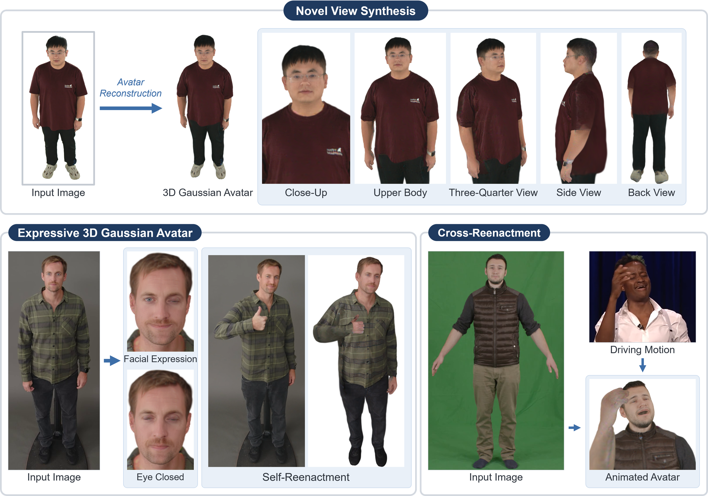

# SRE-Avatar: High-Fidelity Expressive 3D Gaussian Avatars from a Single Image

[](https://xrlabku.webflow.io/papers/sreavatar)
[](https://youtu.be/uNoC92_ulhk)

<p align="center">
  
</p>

## Install
Windows, NVIDIA GPU. Install these first:
- [conda](https://www.anaconda.com/download)
- [git](https://git-scm.com/download/win)
- [Visual Studio Build Tools](https://visualstudio.microsoft.com/visual-cpp-build-tools/) with the "Desktop development with C++" workload
- [CUDA Toolkit 12.8](https://developer.nvidia.com/cuda-12-8-0-download-archive)

Then run `install.bat` from the project folder (`SREAvatar/`):
```
install.bat
```

### Files
- Download the SMFLIX model from SMFLIX ([zip](https://drive.google.com/file/d/1vaLSxP-FaMEUZdPkt1ZHOcNX1m_msM5Y/view?usp=sharing)) and unzip it into `common/utils/human_model_files/`.
- Download the trained [avatars](https://drive.google.com/file/d/1VwkLUbPD6J_gllrm0Q47uESqLMozQgfK/view?usp=drive_link) and unzip them so that each one is at `avatars/<subject_id>/snapshot_<epoch>.pth`.

```
SREAvatar/
├── avatars/
│   ├── 00028/snapshot_4.pth
│   ├── V00_S0394_I00000487_P0526/snapshot_4.pth
│   └── jogging/snapshot_4.pth
└── common/utils/human_model_files/
    └── SMFLIX/
        ├── SMFLIX_NEUTRAL.npz
```

## Viewer
Run from `main/`:
```
conda activate sreavatar                                                     
cd main
python viewer.py
```

### Mouse (on the image)
- Left drag: orbit
- Right drag: pan
- Wheel: zoom

### Avatar and motion
Switch avatars in AVATAR and choose a motion (`captured`, `face_demo`, `walking`) in PLAY, then press Play.

<p>
  
  
</p>


